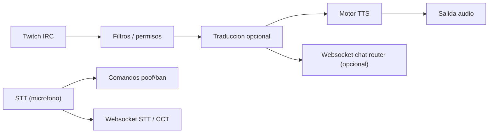

# Manual tecnico (TTS ApliArte)

## 1. Objetivo
- Aplicacion Flutter para leer chat de Twitch en voz alta.
- Incluye traduccion en vivo y filtros anti spam.
- Enfocado en streamers hispanos.

## 2. Requisitos
1. Flutter 3.38 o superior.
2. Acceso a microfono (si usas STT).
3. Conexion a Internet.
4. Servidor de traduccion (opcional) y servidor VibeVoice (opcional).

## 3. Arquitectura (pipeline)


## 4. Arranque
1. `flutter pub get`
2. `flutter run -d macos`
3. Abrir la app.

## 5. Twitch (chat)
1. `Twitch Username`: tu usuario.
2. `OAuth Token`: token de chat (formato `oauth:xxxxx` o sin prefijo).
3. `Channel`: canal a escuchar.
4. Pulsa `Conectar`.

## 6. Traduccion
1. `Source Language`: usa `auto` si quieres deteccion automatica.
2. `Dest Language`: ejemplo `es`, `en`, `pt`.
3. `Translation API Base URL`: URL base del servidor de traduccion.
4. La app envia `POST /translate` con JSON:
   - `q`: texto
   - `source`: idioma origen
   - `target`: idioma destino
   - `format`: `text`
   - `api_key`: opcional

## 7. Filtros y permisos
1. `Delete commands starting with !`: evita leer comandos.
2. `Allow Everyone/Mods/Vips/Subs`: controla quien puede ser leido.
3. `Replace @usernames`: convierte `@nick` a nombre hablado.
4. `Speak emotes` + `Dedup emotes`: controla emotes repetidos.
5. Similaridad Levenshtein:
   - Por usuario y global.
   - `%` y `Time` en segundos.

## 8. Motor TTS
### System TTS
1. Selecciona `TTS Engine = System TTS`.
2. Ajusta `System Language` y `System Voice`.

### VibeVoice
1. Selecciona `TTS Engine = VibeVoice`.
2. `VibeVoice Base URL`: por defecto `ws://localhost:3000`.
3. `VibeVoice Voice`: voz del servidor.
4. `CFG Scale`, `Inference Steps`, `Sample Rate`.
5. Pulsa `Refresh voices` para leer `/config`.

Comando de servidor (ejemplo):
```
python -m uvicorn demo.web.app:app --reload --port 3000
```

## 9. Microfono y comandos
1. Activa `Use Speech Recognition`.
2. `Poof pattern`: corta el TTS actual.
3. `Ban pattern`: corta y reproduce confirmacion.
4. `Pause TTS while speaking`: evita solapado.

## 10. Websockets
1. `STT Command Websocket`:
   - Envia `{ type: "stt", text: "..." }`.
2. `Chat Router Websocket`:
   - Envia `{ type: "chat", user, display, text, channel }`.
   - Si la respuesta contiene `{ text: "..." }`, se usa ese texto.
3. `External CCT Websocket`:
   - Envia `{ type: "cct", text: "..." }`.

## 11. Overlay
1. Ajusta estilos en la seccion `Overlay`.
2. Copia la URL generada.
3. En OBS usa `Browser Source`.

## 12. Problemas comunes
1. No hay sonido:
   - Revisa motor TTS.
   - Comprueba volumen del sistema.
2. No conecta Twitch:
   - Token OAuth incorrecto.
   - Canal mal escrito.
3. No traduce:
   - API no responde.
   - Idioma destino en `auto`.
4. VibeVoice mudo:
   - Servidor no iniciado.
   - Sample rate distinto a 24000.

## 13. Servidor VPS (streaming remoto)
El directo se transmite desde un VPS (ver `docs/SERVIDOR_VPS.md` para detalles completos).

1. El overlay esta en `https://directo.apliarte.com`.
2. El panel de control de capas esta en `https://directo.apliarte.com/panel.html`.
3. Para acceder al panel de NPM desde fuera de casa:
   ```bash
   ssh -L 81:localhost:81 root@72.60.187.93
   ```
   Luego abre `http://localhost:81` en el navegador.
4. Para reiniciar el streamer:
   ```bash
   ssh root@72.60.187.93
   cd /home/apliarte/docker/services/tts-overlay
   docker compose --profile live restart streamer
   ```

## 14. Checklist antes de directo
1. Conectado a Twitch.
2. Traduccion configurada.
3. Motor TTS elegido.
4. Overlay probado.
5. Logs sin errores.
6. Streamer corriendo en VPS (`docker ps | grep streamer`).
7. Camaras conectadas a VDO.ninja (push URL).
